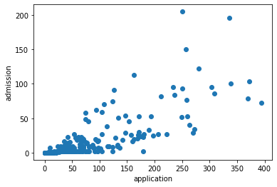
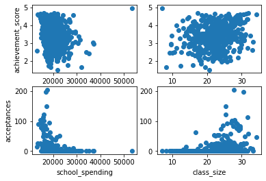
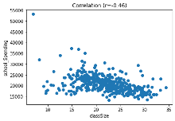

# NYC Specialized High School Admission Analysis

## Description:
- In NYC, there are 8 specialized high schools (SPS), that are highly selective and sought for. 
- The admission of these schools are based on scoring sufficiently on a single test known as the Specialized High Schools Admissision Test (SHSAT). 
- The goal of this project to explore various characteristics of NYC middle school and determine which factors impact SPS admissions. 

## Findings:
- The largest factor that impacts SPS acceptances is the number of applications.
- Importantly, school climate factors (i.e., how well the students perceive the school) is the best predictor for Achievement test scores, but irrelevant when predicting SPS acceptances
- This suggest the possiblity of a latent factor that is captured by the number of applications, but not by school climate factors (e.g., being surrounded by like-minded peers)
- Overall, NYC middle schools should focus on getting more students to apply
  - Nearly 10% of schools have 0 applications.
- One surprising finding is how school spending negatively impacts SPS acceptance. This will be further explained in the Methods/Results section.

## Work
- The code for this project can be found in `analysis.ipynb` under the main directory
- Visualization of the findings can be found [here](https://public.tableau.com/views/NYCSPSAnalysis/Dashboard1?:language=en-US&publish=yes&:display_count=n&:origin=viz_share_link)

## Dataset:
The dataset (`middleSchoolData.csv`) contains data from all 594 NYC middle schools (485 public schoools and 109 charter schools) from a randomly picked year in the past 5 years(2015-2020). Each row represent a single school.  
The columns represent:  
- A-B: NYC DOE school code and name, respectively  
- C: Number of applications to HSPHS originating from this school
- D: Number of applicants to HSPHS accepted from this school
- E: Per student spending, in $
- F: Average class size
- G-K: Self-described ethnic identity of the student body
- L-Q: Average rating of “school climate” factors as perceived by the students,e.g. trust 
- R: Percentage of students who have been evaluated as disabled
- S: Percentage of students living in households below the poverty line
- T: Percentage of ESL students
- U: School size (Number of students in the entire school)
- V: Average student achievement on a state-wide standardized test
- W-X: Proportion of students exceeding state-wide expectations in reading and math

## Methods/Results:

### Overview:
- I will be using various regression analysis to find the most relevant predictor of SPS acceptances
  - In addition, I will be predicting the best predictor for Achievement Test scores to
### Effect of Student Perception of School:
- To begin, I conducted a PCA, which included all factors except for the two outcomes (HSPHS acceptances, objective achievement scores). Based on the PCA results, I chose four factors and labeled them as positive school climate, large population, improvised communities, and financial stability.
- Then, I used a multiple regression model with these principal components as predictors and ran two models, one with the HSPHS acceptances (column D) as the outcome and another with the average student achievement scores (column V) as the outcome.
- The results showed positive school climate as the most significant factor in prediction acceptances and objective achievement scores

#### Regression Results:

|                                | Regression 1 (acceptances) | Regression 2 (achievements) |
|--------------------------------|----------------------------|-----------------------------|
| PCA1 (positive school climate) | 0.25                       | 0.20                        |
| PCA2 (large population)        | 0.17                       | -0.10                       |
| PCA3 (improvised communities)  | 0.04                       | 0.06                        |
| PCA4 (financial stability)     | -0.08                      | 0.09                        |
| R^2                            | 0.45                       | 0.25                        |

### Effect of School Size:
- Number of applicants and class size positively correlate with HSPHS acceptances 
- Correlation between the number of applications and HSPHS acceptances (r=0.81)

- Correlation between class size and HSPHS acceptances (r=0.36)/achievement scores (r=0.21) 

### Effect of School Spending:
- As shown in the image above, school spending has a negative impact on both achievement scores (r=-0.15) and HSPHS acceptances (r=-0.34). 
- In addition, I conducted an independent t-test to test whether or not school spending impacts HSPHS acceptances
    - Compared the means of HSPHS acceptances between poor and rich schools. The groups were artifically divided using the median of the `spending per student` (column E).
    - Based on the t-test results, I concluded that scholl spending negatively impacts (t=-6.9,p<0.01) HSPHS acceptances
- Although this may seem counterintuitive, when you consider the negative correlation between class size and school spending (r=-0.46), it illustrates a clearer picture.

- Larger schools have a disproportional per student spending when compared to that of smaller schools, and because these large schools have higher acceptances, it makes it seem as if more spending leads to lower acceptances. So, if the per student spending was proportional to the class size across all schools, the school spending may positively impact HSPHS acceptances
