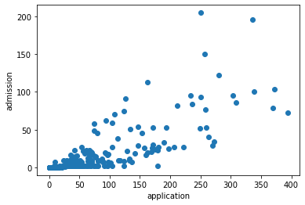

# NYC SHSAT Admission Analysis

## Work
- The code for this project can be found in `analysis.py`
- THe report for this project can be found in `analysis_report.pdf`

## Description:
- In NYC, there are 8 highly selective public high schools (HSPHS). The admission of these schools are based on scoring sufficiently on a single test known as the Specialized High Schools Admissision Test (SHSAT). 
- The goal of this project to explore various characteristics of NYC middle schools, determine which factors impact HSPHS admissions, and propose possible interventions. 
- This is a modified version of the Introduction to Data Science Capstone Project. A detailed explanation of the methodology is in the `analysis_report.pdf` file

## Dataset:
The dataset (`middleSchoolData.csv`) contains data from all 594 NYC middle schools (485 public schoools and 109 charter schools) from a randomly picked year in the past 5 years. Each row represent a single school.  
The columns represent:  
- A-B: NYC DOE school code and name, respectively  
- C: Number of applications to HSPHS originating from this school
- D: Number of applicants to HSPHS accepted from this school
- E: Per student spending, in $
- F: Average class size
- G-K: Self-described ethnic identity of the student body
- L-Q: Average rating of “school climate” factors as perceived by the students,e.g. trust 
- R: Percentage of students who have been evaluated as disabled
- S: Percentage of students living in households below the poverty line
- T: Percentage of ESL students
- U: School size (Number of students in the entire school)
- V: Average student achievement on a state-wide standardized test
- W-X: Proportion of students exceeding state-wide expectations in reading and math

## Conclusion:

## Findings:
- The largest factor that impacts HSPHS acceptance is how well the students perceive the school. This factor is represented by columns L-Q, which include metrics such as how much students believe that school can be trusted, supportive, and collaborative. 
-  The second largest factor that impacts HSPHS acceptance is the size of the school, both in terms of class size and applicants.
- One surprising finding is how school spending negatively impacts HSPHS acceptance. This will be further explained in the Methods/Results section. 

## Methods/Results:

### Effect of Student Perception of School:
- To begin, I conducted a PCA, which included all factors except for the two outcomes (HSPHS acceptances, objective achievement scores). Based on the PCA results, I chose four factors and labeled them as positive school climate, large population, improvised communities, and financial stability.
- Then, I used a multiple regression model with these principal components as predictors and ran two models, one with the HSPHS acceptances (column D) as the outcome and another with the average student achievement scores (column V) as the outcome.
- The results showed positive school climate as the most significant factor in prediction acceptances and objective achievement scores

#### Regression Results:

|                                | Regression 1 (acceptances) | Regression 2 (achievements) |
|--------------------------------|----------------------------|-----------------------------|
| PCA1 (positive school climate) | 0.25                       | 0.20                        |
| PCA2 (large population)        | 0.17                       | -0.10                       |
| PCA3 (improvised communities)  | 0.04                       | 0.06                        |
| PCA4 (financial stability)     | -0.08                      | 0.09                        |
| R^2                            | 0.45                       | 0.25                        |

### Effect of School Size:
- Number of applicants and class size positively correlate with HSPHS acceptances 
- Correlation between the number of applications and HSPHS acceptances (r=0.81)

- Correlation between class size and HSPHS acceptances (r=0.36)/achievement scores (r=0.21) 

### Effect of School Spending:
- As shown in the image above, school spending has a negative impact on both achievement scores (r=-0.15) and HSPHS acceptances (r=-0.34). 
- In addition, I conducted an independent t-test to test whether or not school spending impacts HSPHS acceptances
    - Compared the means of HSPHS acceptances between poor and rich schools. The groups were artifically divided using the median of the `spending per student` (column E).
    - Based on the t-test results, concluded that scholl spending negatively impacts (t=-6.9,p<0.01) HSPHS acceptances
- Although this may seem counterintuitive, when you consider the negative correlation between class size and school spending (r=-0.46), it illustrates a clearer picture.
|[corr](images/correlation_multiple2png.png)
- Larger schools have a disproportional per student spending when compared to that of smaller schools, and because these large schools have higher acceptances, it makes it seem as if more spending leads to lower acceptances. So, if the per student spending was proportional to the class size across all schools, the school spending may positively impact HSPHS acceptances

## Questions
1.  What is the correlation between the number of applications and admissions to HSPHS?
2.  What is a better predictor of admission to HSPHS? Raw number of applications or
application *rate*?
3) Which school has the best *per student* odds of sending someone to HSPHS?
4) Is there a relationship between how students perceive their school (as reported in columns
L-Q) and how the school performs on objective measures of achievement (as noted in
columns V-X).
5) Test a hypothesis of your choice as to which kind of school (e.g. small schools vs. large
schools or charter schools vs. not (or any other classification, such as rich vs. poor school)) performs differently than another kind either on some dependent measure, e.g. objective measures of achievement or admission to HSPHS (pick one).
6) Is there any evidence that the availability of material resources (e.g. per student spending or class size) impacts objective measures of achievement or admission to HSPHS?
7) What proportion of schools accounts for 90% of all students accepted to HSPHS?
8) Build a model of your choice – clustering, classification or prediction – that includes all
factors – as to what school characteristics are most important in terms of a) sending
students to HSPHS, b) achieving high scores on objective measures of achievement?
9) Write an overall summary of your findings – what school characteristics seem to be most
relevant in determining acceptance of their students to HSPHS?
10) Imagine that you are working for the New York City Department of Education as a data
scientist (like one of my former students). What actionable recommendations would you make on how to improve schools so that they a) send more students to HSPHS and b) improve objective measures or achievement.
